# EC2에 서버 업로드하기

`git clone`으로 `ktor`으로 제작한 서버 repository를 EC2 인스턴스에 내려받아 `jar` 파일으로 빌드하여 서버를 배포하는 것을 써보겠습니다.

( Ubunto 인스턴스를 사용하며, 자동 배포를 다음에 공부하면서 적용하기로 하고, 수동 배포만 해보겠습니다. )

이글의 목차는 다음과 같다.

1. **AWS** 세팅하기
2. 발급받은 SSH키로 EC2 인스턴스에 접속
3. 우분투 인스턴스에 `repository` clone
4. 서버 빌드하고 `jar`파일로 빌드하고 실행시켜 서버 배포

 
 

# 1. AWS 세팅하기

## 1-1. 리전 설정하기

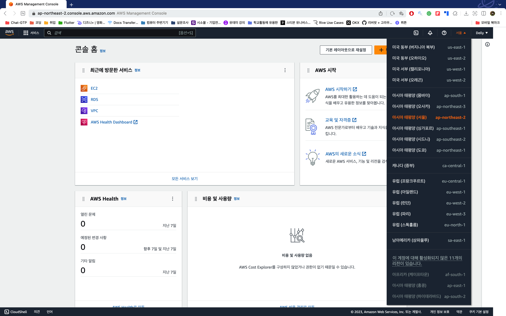

AWS에 접속한뒤 리전을 서울로 설정합니다. 
다른 지역에 인스턴스를 만들어도 되지만, 현재 한국에 거주하고 있고,또 리전별로 인스턴스를 만들수 있기에 인스턴스 관리가 힘들어질것 같아서 현재 거주하고 있는 곳으로 인스턴를 생성하는게 제일 관리하기 편할것 같다고 생각합니다.

 
 

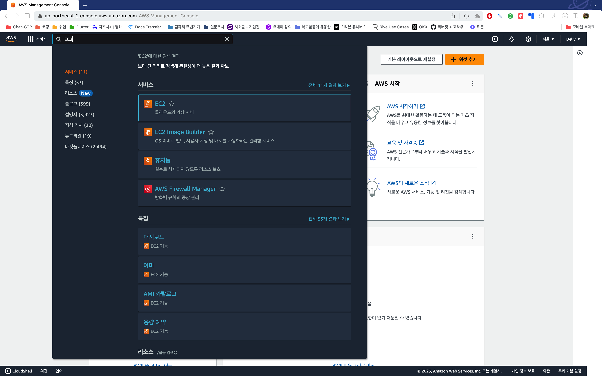

그다음 검색창을 열어서 EC2를 검색하여 EC2에 들어갑니다.

 
 

## 1-2. 인스턴스 생성하기

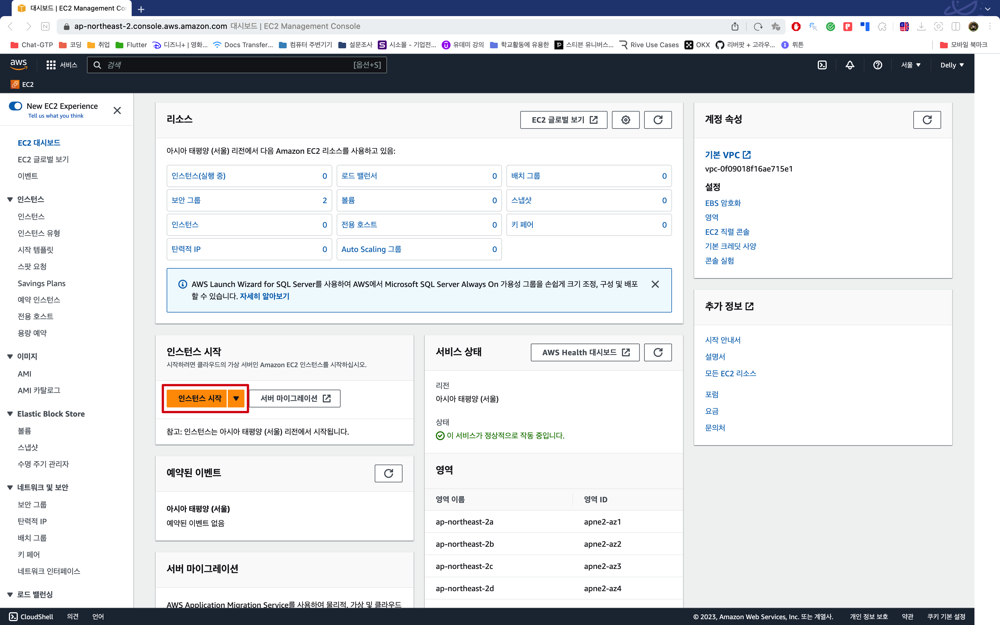

EC2 화면에 들어오면 인스턴스 시작 버튼을 눌러 새로운 인스턴스를 만들어줍니다.

 
 

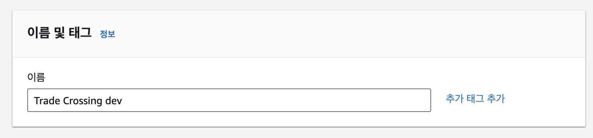

여기서 인스턴스 이름을 지정해줄수 있습니다. 인스턴스 이름은 필수가 아니라 지정해주지 않아도 되지만, 추후에 만들어질수 있는 다른 인스턴스들과 헷갈리지 않기 위해 지정해주는 것이 좋습니다.

 
 

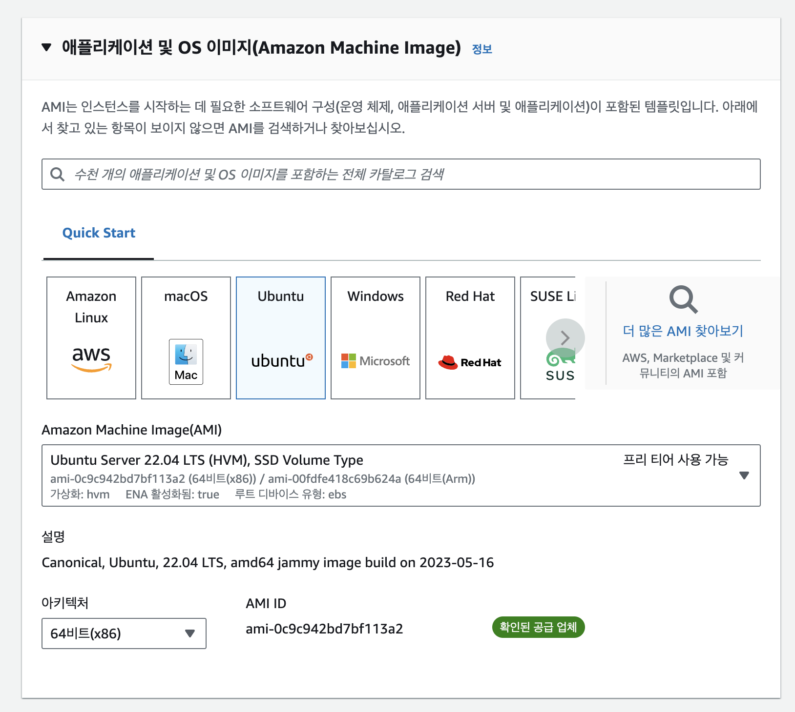

이 부분에서 인스턴스 `AMI`를 세팅할 수 있습니다. 원하는 `OS`를 선택하면 되는데, 저는 무료 티어가 가능한 우분투를 사용할 것이니 `Ubuntu LTS`를 선택하겠습니다.

 
 

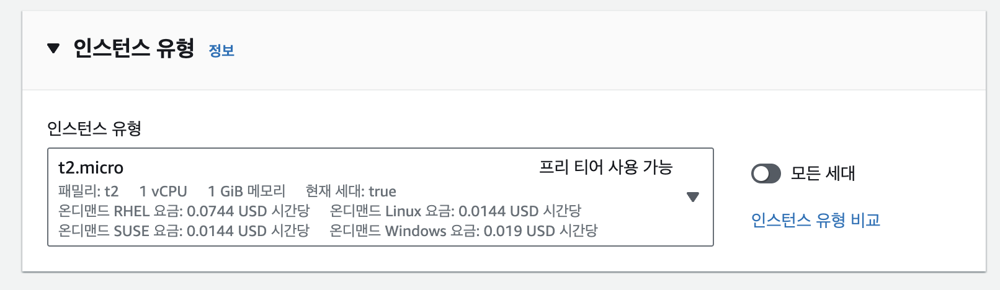

이 곳에서 인스턴스의 유형을 선택할 수 있습니다. 하지만 무료 티어가 가능한 것은 `t2.micro`뿐이니 `t2.micro`을 선택하겠습니다.

 
 

## 1-3. 키 페어 생성하기

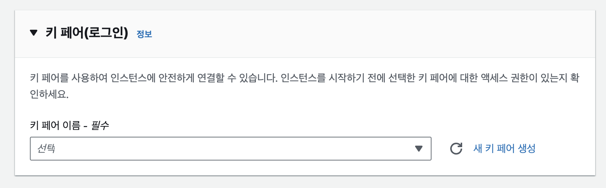
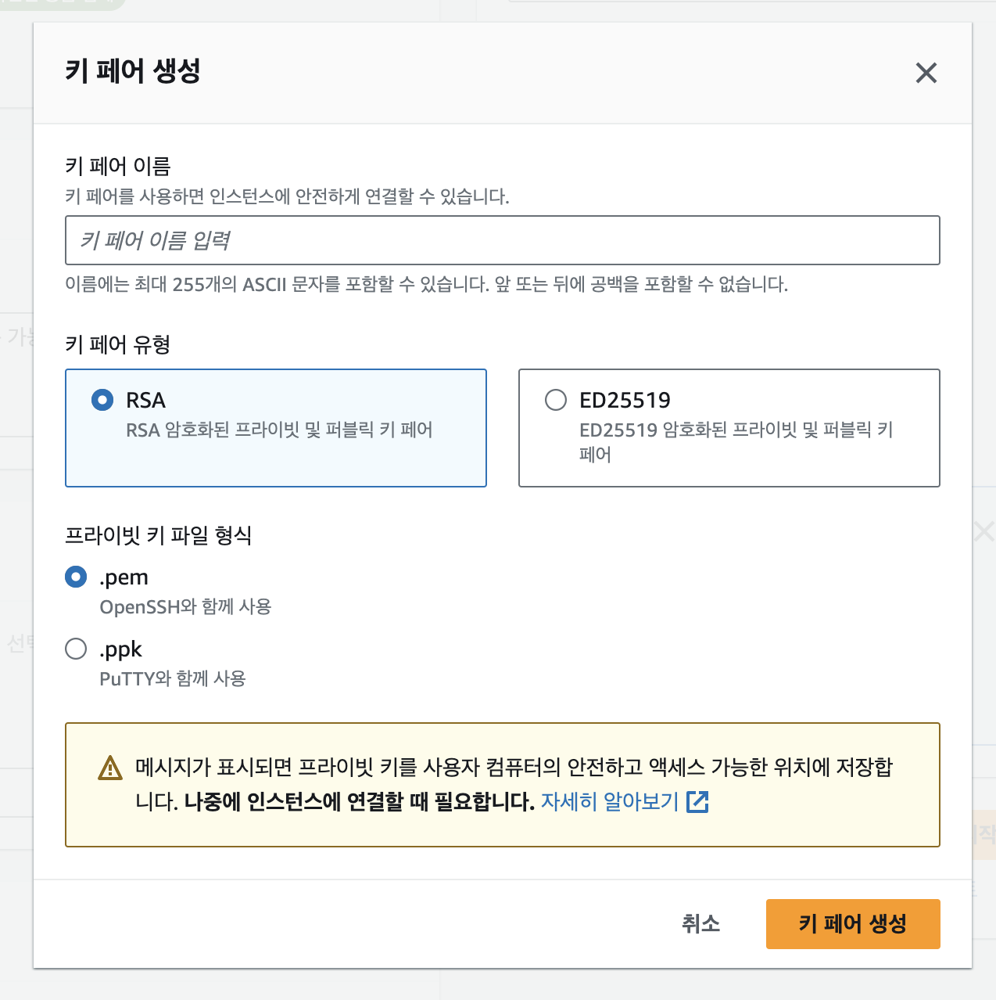

키 페어는 추후에 원격으로 EC2 인스턴스에 접속할때 필수적으로 필요하게 되므로 키를 생성하도록 하겠습니다. 또한 키는 생성하고 다운로드 후에는 두번다시 다운로드할 수 없으니, 안전한곳에 보관해야합니다.
`키 페어 이름`을 지정한후 생성합니다. 
(기존에 이미 키를 생성한 경우에는 다시 생성하지 않고 기존의 키를 사용할 수 있습니다.)

 

## 1-4 네트워크 세팅

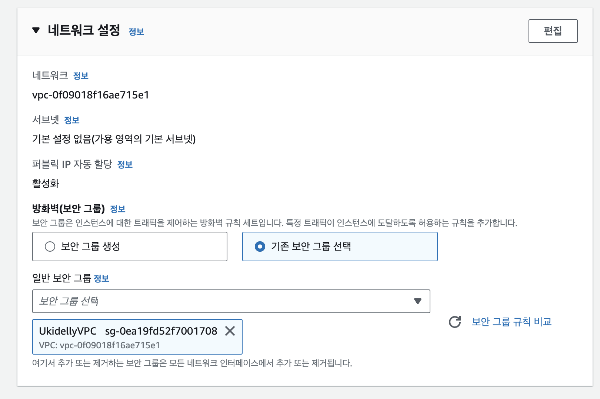

여기서 보안읈 설정할 수 있는데, 기존에 보안 그룹을 생성했으니 기존꺼를 선택하고 넘어가겠습니다.

 

## 1-5 스토리지 설정

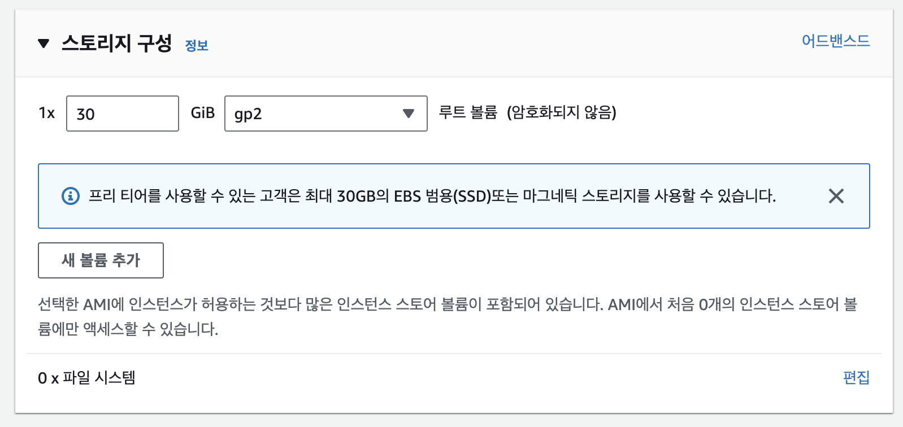

여기서 인스턴스의 스토리지를 설정할 수 있습니다. 프리티어는 30Gb까지 지원해주므로 최대치인 30으로 설정하겠습니다. (옆의 어드밴스드 탭에서 상세 설정이 가능합니다.)

_Provisioned IOPS SSD ( 프로비저닝된 IOPS SSD )를 선택하면 사용하지 않아도 활성화한 기간만큼 비용이 발생합니다._

## 1-6 최종 생성

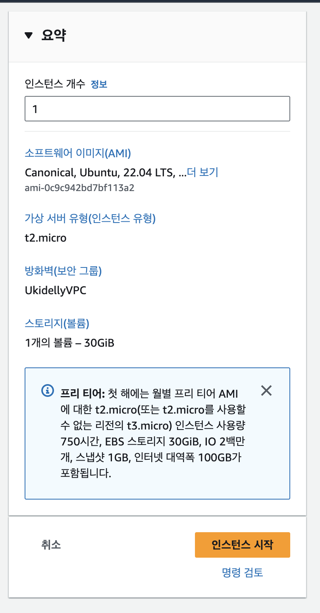

설정을 다 마치고, 옆에 요약 탭을 확인해서 원하는대로 설정이 다 되었는지 확인하고 `인스턴스 시작` 버튼을 눌러 인스턴스를 생성합니다.